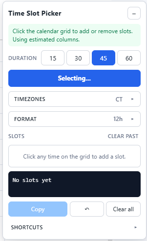

# Time Slot Picker

A Chrome extension that turns your Google Calendar into a click-to-share availability picker. Click the times you're free, hit Copy, paste the result anywhere.

**Before:** "I'm free Tuesday 2–3 PM ET, or Wednesday 10–11 AM ET, or..."
**After:** Click. Click. Click. Copy. Done.

<p align="center">
  
</p>

The sidebar docks beside your calendar. Pick a duration, click slots on the grid, copy the result.

## Example output

```
Does a time in here work for you? Just let me know and I'll fire over an invite!

Tue, May 20
  2:00 – 3:00 PM ET

Wed, May 21
  10:00 – 11:00 AM ET
  3:00 – 4:00 PM ET
```

## Install

Not on the Chrome Web Store — load it unpacked:

1. Clone or download this repo
2. Open `chrome://extensions/`
3. Toggle **Developer mode** (top right)
4. Click **Load unpacked** and select the `extension/` folder
5. Open [Google Calendar](https://calendar.google.com/) in **Week** or **Day** view

The toolbar icon shows or hides the sidebar.

## How to use

1. **Pick a duration** — 15, 30, 45, or 60 minutes
2. **Turn on Select Mode** — button or `Alt+S`
3. **Click slots on the calendar** — click again to remove
4. **Set the output timezone** if you're sharing across zones
5. **Hit Copy** and paste anywhere

## Features

- **DST-safe timezone conversion** — set calendar and output zones independently; no fragile offset math
- **Multi-account aware** — selections stay scoped per Google account
- **No build, no dependencies, no tracking** — vanilla JS, runs entirely in your browser
- **Click to select, click to deselect** — directly on the calendar grid
- **Custom intro message** — add a personal note above your slots
- **12h / 24h clock** — your call
- **Optional date headers and zone labels** — keep them or strip them
- **Past slot pruning** — expired slots disappear from the copy automatically; one click clears them from the list
- **Undo** — `Ctrl+Z` or the ↶ button
- **Persistent** — selections survive refreshes and tab closes
- **Dark mode** — follows your system

## Keyboard shortcuts

| Shortcut | Action |
|---|---|
| `Alt+S` | Toggle Select Mode |
| `Ctrl+Z` | Undo last change |
| `Esc` | Exit Select Mode |

## Permissions

| Permission | Why |
|---|---|
| `storage` | Save your selections and settings locally |
| `scripting` | Re-attach to Calendar tabs that were already open before install |

No network requests. Nothing leaves your browser.

## Development

```bash
npm test            # Run the test suite
npm run test:watch  # Watch mode
```

No build step — edit files in `extension/`, then reload the unpacked extension in Chrome.

For UI work without a live Calendar tab, there's a visual harness at `docs/visual-harness.html`:

```bash
python -m http.server --bind 127.0.0.1 8765
# open http://127.0.0.1:8765/docs/visual-harness.html
```

## Contributing

Bug reports and pull requests welcome. A few notes before you dive in:

- All times are stored as UTC ISO strings; wall-clock conversion happens at display time
- `grid-anchor.js` probes Google Calendar's DOM, which changes without notice — treat it as fragile
- The manifest test asserts content script load order; update it if you add new files
